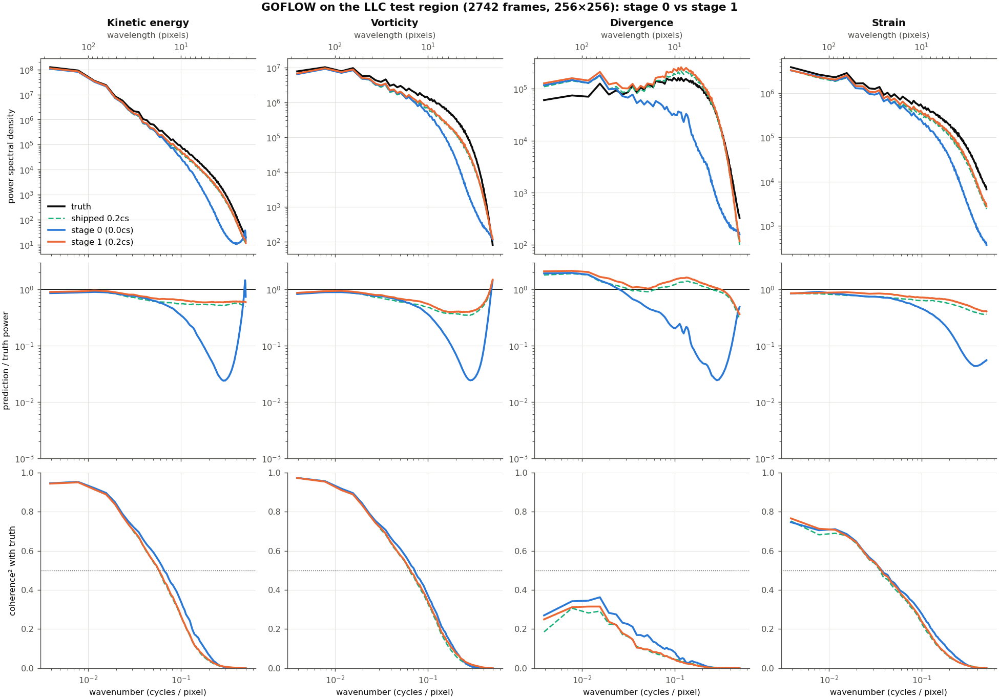
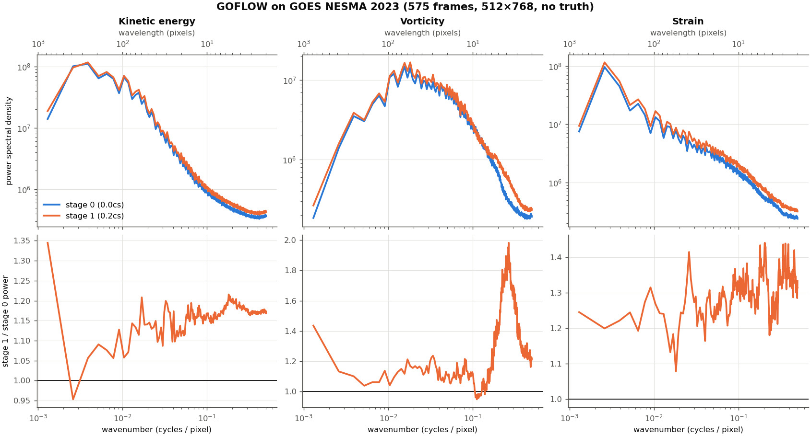

# Reproducing GOFLOW on NCAR Derecho

Notes for this fork, verified 2026-09-29.

## 1. Environment

Use the existing conda env `neurost` (Python 3.9, torch 2.3.0 + CUDA 12.1,
netCDF4 1.7.2, scipy, psutil). `scikit-learn` was added to it for this repo
(`goflow_core.py` imports `sklearn.metrics.r2_score` at module level):

```bash
env -u PYTHONPATH /glade/work/lgchen/conda-envs/neurost/bin/python -m pip install scikit-learn
```

**Gotcha:** the Derecho login shell exports a long spack-stack `PYTHONPATH` that
shadows any conda env's numpy and fails with
`No module named 'numpy.core._multiarray_umath'`.
Always `unset PYTHONPATH` (or prefix with `env -u PYTHONPATH`).

## 2. Data

The three inputs are symlinked in the repo root to
`/glade/u/home/lgchen/lgchen_scratch_derecho/data/ML-SSH-SSC/fromOtherPeople/GOFLOW/forRunningGoflow/`:

| File | Size | Shape |
|---|---|---|
| `llcGoes_gradT_trunc.nc` | 129 GB | time 8230, lat 551, lon 1001 |
| `GS_BT_NESMA2023_HiRes_SUBSECTION_grad_mask.nc` | 6.6 GB | time 600, lat 551, lon 1001 |
| `GS_20230413T000000_20230415T000000_DT01_grad_mask_updated.nc` | 7.6 GB | (Figure 1 period) |

Datasets are read lazily through open netCDF handles, so RAM is not driven by file size.
With `nframes=3, step0=1` and non-overlapping sampling, the LLC test region yields
**2742 samples**; the GOES file yields **575**.

## 3. Two flags the README gets wrong

1. **`--inp_norm` is required** for the shipped `lgt_unet16_1_3_0.2cs.pth`.
   The checkpoint contains input-BatchNorm (`bn.*`) weights, but
   `inf_llc_stage1.py` defaults `inp_norm=False` and `load_model` loads strictly,
   so it raises `Unexpected key(s) in state_dict` and crashes. The README example omits it.
2. **`--goes_files` must be bare filenames relative to the working directory.**
   The satellite output name is built by concatenating the given path
   (`f'preds_..._{goes_file}'`), so an absolute path produces a filename containing
   `/` and the write fails. Run from a directory holding symlinks to the inputs.

Also: `--blend_alpha` defaults to **0.5**, which mixes 50% ground truth into the
saved "prediction". Use `--blend_alpha 0.0` for an honest test-set output.

The README's inference example names `lgt_unet16_1_3_0.5cs.pth`, but the file shipped
in the repo is `lgt_unet16_1_3_0.2cs.pth` (i.e. `c_spec=0.2`).

## 4. Run inference

Outputs are tens of GB and `/glade/work` is ~90% full, so run on scratch:

```
/glade/derecho/scratch/lgchen/goflow_runs/infer_20260929/run_infer.pbs
```

Key line:

```bash
python $REPO/inf_llc_stage1.py \
    --model_file lgt_unet16_1_3_0.2cs.pth --inp_norm --nbase 16 \
    --goes_files GS_BT_NESMA2023_HiRes_SUBSECTION_grad_mask.nc \
    --llc_file llcGoes_gradT_trunc.nc \
    --output_dir ./ncfiles/ --batch_size 16 --blend_alpha 0.0
```

Produces `ncfiles/test_results_epoch.nc` (LLC test region: gradT, U/V truth vs
prediction, vorticity/divergence/strain) and `preds_lgt_unet16_1_3_0.2cs_<goes>.nc`
(satellite inference, the FIG02 fields).

## 5. Train (two stages)

```
/glade/derecho/scratch/lgchen/goflow_runs/train_20260929/train_stage0.pbs   # c_spec 0.0, 100 epochs
/glade/derecho/scratch/lgchen/goflow_runs/train_20260929/train_stage1.pbs   # c_spec 0.2, 50 epochs
```

Stage 1 auto-loads `lgt_unet16_1_3_0.0cs.pth` written by stage 0, so chain them:

```bash
cd /glade/derecho/scratch/lgchen/goflow_runs/train_20260929
J0=$(qsub train_stage0.pbs)
qsub -W depend=afterok:$J0 train_stage1.pbs
```

**Always pass `--skip_satellite --skip_eval_nc` when training.** Otherwise every
epoch that improves gradient R² writes multi-GB NetCDFs *and* re-runs full
satellite inference — early epochs improve almost every time, so this dominates
runtime. Run inference separately afterwards.

## 6. PBS notes

- Account: `UMCP0053`.
- Derecho GPU nodes are **exclusive**, so asking for 1 GPU still waits for a whole
  free node; expect queue time.
- `gpu_type` must go inside the `select` chunk, not as a job-level `-l` resource.
- `gpudev` caps walltime at 1 hour — fine for inference, not for training.

## 7. Results obtained (2026-09-29)

Job 7641670, 1x A100-40GB, **~4 minutes** wall (plus ~6 min queue).
Model: shipped `lgt_unet16_1_3_0.2cs.pth` (1.08M params), `--blend_alpha 0.0`.

LLC test region `(0:256, 745:1001)`, 2742 samples. Script-reported **Test R² = 0.8878**
(U and V pooled). Per field, on an 8-pixel interior crop:

| Field | R² |
|---|---|
| U | +0.894 |
| V | +0.888 |
| Vorticity | +0.592 |
| Divergence | **-0.674** |
| Strain | +0.299 |

Gradient R² as the repo defines it (mean of vorticity and strain) = **0.446**, which sits
in the 0.19–0.5 band reported in `docs/spatial_transferability.md`.

Divergence is *not* skillfully predicted (negative R²). This is expected rather than a
setup error: divergence is largely ageostrophic and its amplitude is small
(truth std 6.4e-2 vs vorticity 2.4e-1), so there is little signal to recover from SST
gradients. Note the paper's headline metrics are velocity and the
vorticity/strain gradient R², not divergence.

Satellite inference on the NESMA GOES file: 575 frames, 512x768, all fields finite,
U/V within ±1.2 m/s. `BT` is 88.2% finite — the rest is cloud mask, as expected.

### Caveat: trailing empty records in the satellite output

`SatelliteDataset.__len__` is `ntime - 25` = **575**, but `writeGridSat` creates the
output with `time = ntime - 3` = **597**. Records **575–596 are all fill/masked**.
Truncate to `[:575]` before analysing or plotting, or the last 22 frames will read as zero.

### Output files

```
/glade/derecho/scratch/lgchen/goflow_runs/infer_20260929/
├── ncfiles/test_results_epoch.nc                                    7.4 GB
└── preds_lgt_unet16_1_3_0.2cs_GS_BT_NESMA2023_HiRes_SUBSECTION_grad_mask.nc   5.9 GB
```

## 8. Retrained model: results and spectra (2026-09-29)

### Training

The two-stage recipe in §5 run as-is (1x A100):

| Job | Stage | Wall | Best gradR² | Best velR² | Best Spec |
|---|---|---|---|---|---|
| 7643356 | 0: `c_spec 0.0`, 100 epochs | 1h38m | 0.440 | 0.900 | 7.05 |
| 7643357 | 1: `c_spec 0.2`, 50 epochs | 53m | 0.397 | 0.890 | 1.80 |

A 3-epoch timing probe (`train_timing3.pbs`) measured ~55 s/epoch after a slow first epoch (~1 min
data load + ~4.5 min epoch 1). Checkpoints: `train_20260929/lgt_unet16_1_3_{0.0,0.2}cs.pth`.

### Inference

Both checkpoints were run through `inf_llc_stage1.py` exactly as in §4 (the retrained
checkpoints also contain `bn.*` weights, so `--inp_norm` is still required).
Jobs 7648907 / 7648908, ~3 min each:

```
/glade/derecho/scratch/lgchen/goflow_runs/infer_retrained_20260929/stage_{0.0,0.2}cs/
```

Per-field R² on the LLC test region (2742 samples, 8-pixel interior crop, same method as §7):

| Model | U | V | Vorticity | Divergence | Strain | gradR² | script Test R² |
|---|---|---|---|---|---|---|---|
| Shipped 0.2cs | 0.894 | 0.888 | 0.592 | -0.673 | 0.299 | 0.446 | 0.8878 |
| Retrained stage 0 (0.0cs) | 0.895 | 0.895 | 0.627 | 0.001 | 0.338 | 0.483 | 0.8923 |
| Retrained stage 1 (0.2cs) | 0.892 | 0.892 | 0.593 | -0.831 | 0.302 | 0.447 | 0.8895 |

The retrained stage 1 reproduces the shipped model. Stage 0 is best on every pointwise metric.

### Wavenumber spectra

Scripts and outputs in `infer_retrained_20260929/`: `spectra_compare.py` (computes
`spectra_compare.npz`, ~4 min on a login node), `spectra_plot.py` (writes
`spectra_llc.png`, `spectra_sat.png` and prints the tables below).
Method: per frame remove the mean, apply a 2D Tukey(0.5) window (as in the training
spectral loss), 2D FFT, radially bin |k| in cycles/pixel, average over frames.
Wavenumbers are left in pixel units; the repo does not state the grid spacing.

LLC test region, predicted / true power by wavelength band (1.0 is ideal):

| Field | Model | >64 px | 16–64 | 8–16 | 4–8 | 2–4 | log₁₀ spectral RMSE |
|---|---|---|---|---|---|---|---|
| KE | shipped | 0.88 | 0.76 | 0.57 | 0.54 | 0.53 | 0.26 |
| | stage 0 | 0.88 | 0.78 | 0.43 | 0.14 | 0.04 | 1.03 |
| | stage 1 | 0.92 | 0.83 | 0.66 | 0.60 | 0.60 | 0.21 |
| Vorticity | shipped | 0.89 | 0.69 | 0.50 | 0.38 | 0.37 | 0.34 |
| | stage 0 | 0.87 | 0.72 | 0.41 | 0.13 | 0.03 | 1.03 |
| | stage 1 | 0.92 | 0.76 | 0.58 | 0.41 | 0.42 | 0.30 |
| Strain | shipped | 0.82 | 0.73 | 0.65 | 0.58 | 0.44 | 0.32 |
| | stage 0 | 0.85 | 0.72 | 0.49 | 0.24 | 0.06 | 0.98 |
| | stage 1 | 0.87 | 0.83 | 0.73 | 0.66 | 0.52 | 0.26 |
| Divergence | shipped | 1.67 | 1.00 | 1.21 | 1.23 | 0.90 | 0.18 |
| | stage 0 | 1.74 | 0.65 | 0.25 | 0.09 | 0.04 | 1.07 |
| | stage 1 | 1.93 | 1.16 | 1.45 | 1.40 | 1.01 | 0.18 |



Squared coherence with truth drops below 0.5 at ~15–17 px (KE, vorticity) and
~26 px (strain), essentially the same for all three models. For divergence it
never exceeds 0.4 at any scale.

GOES satellite (no truth, first 575 frames), stage 1 / stage 0 power:



| Field | >64 px | 16–64 | 8–16 | 4–8 | 2–4 |
|---|---|---|---|---|---|
| KE | 1.07 | 1.14 | 1.16 | 1.18 | 1.17 |
| Vorticity | 1.10 | 1.13 | 1.09 | 1.25 | 1.46 |
| Strain | 1.22 | 1.25 | 1.30 | 1.31 | 1.33 |

Interpretation:

- **Stage 0 is too smooth.** Below ~16 px its power falls to a few percent of truth
  at 2–8 px; it also has a small spurious KE uptick at the grid scale.
- **Stage 1's spectral loss restores small-scale energy** to 40–65% of truth down to
  the grid scale, cutting the spectral error ~4–5x. It matches or slightly beats the
  shipped model at every scale.
- **The restored energy is not phase-correct.** Coherence is unchanged, so the extra
  small-scale energy is realistic in amount but not in position. That is why pointwise
  R² favours the smooth stage 0 (gradR² 0.483 vs 0.447).
- **Divergence is not predicted at any scale**, and stage 1 puts 1.4–1.9x too much
  power into it at mid and large scales, hence its strongly negative R².
- On GOES, stage 0 does not collapse at small scales as it does on LLC: both spectra
  flatten at high k, probably noise and cloud-mask edges in the input BT. Do not read
  small-scale satellite power as ocean signal.

**Which checkpoint to use:** stage 0 for pointwise U/V, vorticity or strain maps; stage 1
for energy-distribution statistics (spectra, eddy statistics, strain PDFs). Ignore
divergence from both.

## 9. GOES inference: land-encoding fix and output caveats (2026-10-07)

Details and figures: `docs/learning/goflow_learning_notes.md`, step 5.

### Code change: land fill value in `SatelliteDataset`

In the LLC training data land has `loggrad_T = 0`, i.e. normalised input **1.0**. In the GOES
files land is NaN (the same 12.3% of pixels in every frame; clouds are never NaN), and
`SatelliteDataset` turned NaN into **0.0**. After the model's input BatchNorm that is about −10
standard deviations, a value never seen in training.

`dataSST.SatelliteDataset` now takes `nan_fill=1.0` (pass `nan_fill=0.0` for the old behaviour).
This affects `inf_llc_stage1.py` and the satellite output of `train_goflow.py`, but not LLC
training or the LLC test evaluation.

GOES inference rerun with the fix (jobs 7749095 / 7749096, `--skip_test`):

```
/glade/derecho/scratch/lgchen/goflow_runs/infer_landfix_20261007/stage_{0.0,0.2}cs/
    preds_lgt_unet16_1_3_<cs>cs_GS_BT_NESMA2023_HiRes_SUBSECTION_grad_mask.nc   5.9 GB each
```

Effect, on clear-sky ocean pixels over all 575 records:
- **Within ~60 km of the coast:** mean velocity changes of 0.07–0.21 m/s. A spurious fast
  coastal band (0.16–0.19 m/s at 8–60 km from land) drops to 0.12–0.13 m/s.
- **Beyond ~125 km:** changes of about 0.01 m/s.
- About a third of the clear-sky ocean pixels lie within 125 km of land.
- There is no GOES truth. The fix is preferred because it matches the training encoding.

The earlier GOES outputs (`infer_20260929`, `infer_retrained_20260929`) used land = 0.0.

### Time-label fix in `writeGridSat` (2026-10-07)

`dataSST.writeGridSat` now labels output record `it` with the GOES time of its centre frame
`it+13` (constant `SAT_CENTRE_OFFSET`), writes exactly as many times as records (575, so no empty
trailing records), and stores time as float64 with the source `units`/`calendar`. Previously it
used frame `it+1` (1 hour early), wrote 597 values (records 575–596 empty), and stored float32
without units (64-s rounding).

`infer_landfix_20261007` was rerun with this fix (jobs 7749167 / 7749168) and verified: 575
records, all times equal to GOES frames 13–587, 2023-05-14 01:07:35 to 2023-05-16 00:57:35 UTC.

### Caveats for GOES `preds_*.nc` files

- **Older outputs only** (`infer_20260929`, `infer_retrained_20260929`): time label 1 hour early
  (use `time[it] + 3600 s`, or frame `it+13`'s time from the GOES file), float32 time without
  units, and empty records 575–596 (§7). Fixed in `infer_landfix_20261007`.
- **Older outputs only:** `BT` and the cloud mask are from frame `it+12`, 5 minutes before the
  prediction centre, and cloudy pixels are written as **0**. Select clear pixels with `U != 0`.
  Fixed in `infer_landfix_20261007`: everything is from frame `it+13`, and cloudy pixels (and
  almost all land) are **NaN**. Select clear pixels with `np.isfinite(U)`.
- **Clouds are not removed from the input (all outputs).** `log_gradT` includes cloud-top
  gradients, and the cloud `mask` is applied only to the output. Only 16–40% (mean 28%) of the
  window is clear, and predictions in clear pixels near clouds are partly driven by cloud texture.
