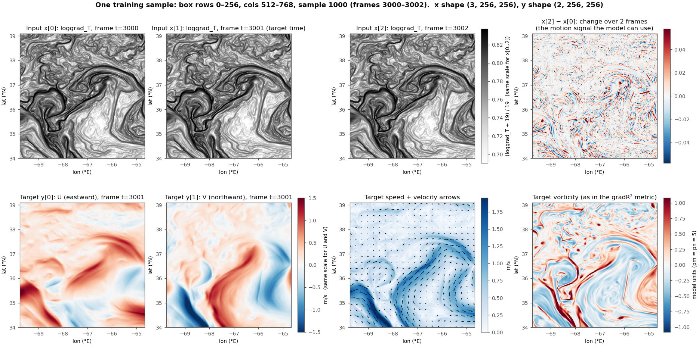
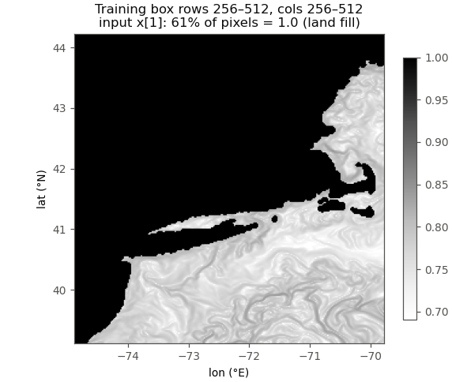
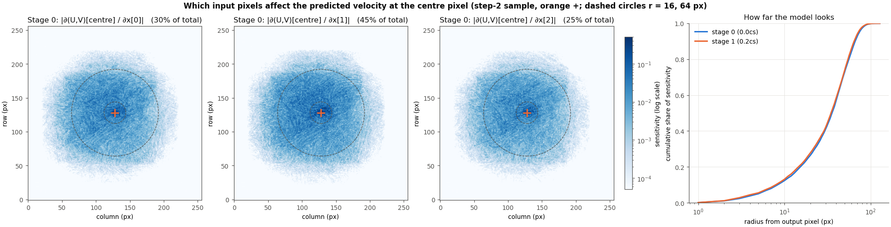
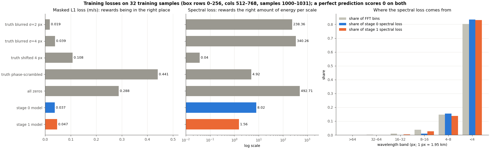
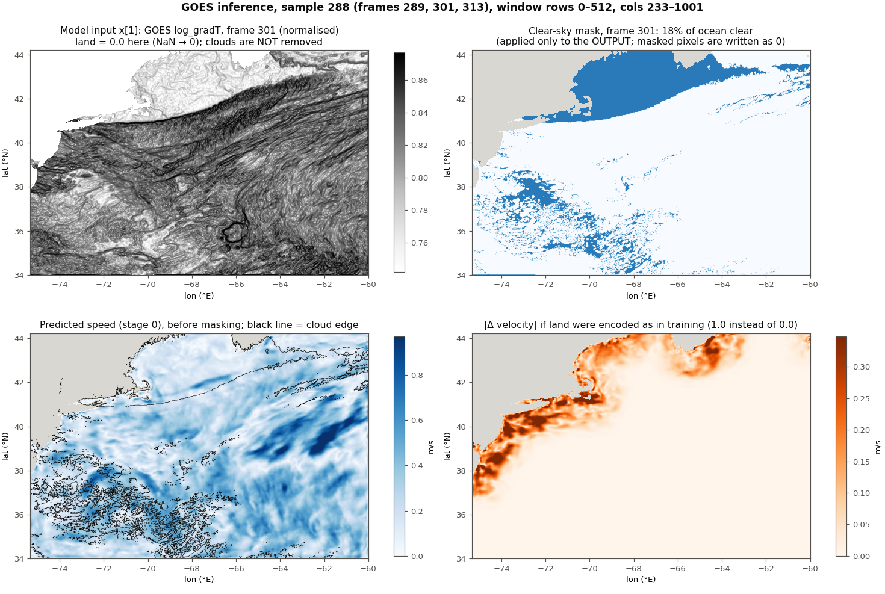
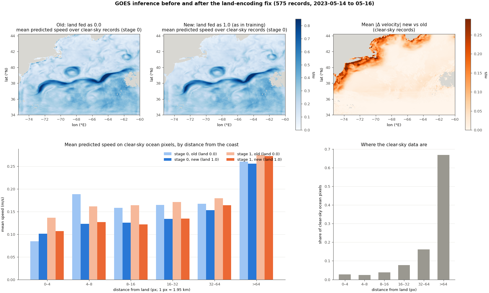

# GOFLOW learning notes

A running log of the step-by-step walkthrough of how GOFLOW works. Each new
question and answer is appended at the end. Setup, run history and results are in
`REPRODUCE_DERECHO.md` at the repo root.

## Contents

1. Training pipeline: scripts, input/output data, where they are used (2026-10-07)
2. One training sample: the 3 input frames and the U/V target (2026-10-07)
3. The UNet architecture, layer by layer (2026-10-07)
4. The loss functions: L1, spectral, and how they combine (2026-10-07)
5. Inference: LLC test region and GOES satellite data (2026-10-07)
   - 5.6 Fixing the GOES land encoding and rerunning inference (2026-10-07)
   - 5.7 Fixing the GOES time label (2026-10-07)
   - 5.8 Aligning BT and the cloud mask; cloudy pixels as NaN (2026-10-07)

---

## Step 1: the training pipeline

> **Q (2026-10-07):** Now that we've finished the train and inference, next I want to dig deep into the details step by step to learn how it actually works. The first step is training: list the script and the input/output data, and where they are used.

How `train_goflow.py` works, traced through the code and checked against the
data files and the 2026-09-29 run logs
(`/glade/derecho/scratch/lgchen/goflow_runs/train_20260929/`).

### 1. Entry point

`train_goflow.py`, run twice from the run directory by the PBS scripts:

| Stage | Command (key flags) | Starting weights |
|---|---|---|
| 0 | `--c_spec 0.0 --epochs 100` | random |
| 1 | `--c_spec 0.2 --epochs 50` | stage 0 checkpoint, loaded automatically |

Shared flags: `--model unet --nbase 16 --lr 0.001 --tcycle 5 --nframes 3 --step0 1 --skip_satellite --skip_eval_nc`.

### 2. Code files and what each provides

| File | Used for | Key pieces |
|---|---|---|
| `train_goflow.py` | Driver | `main()` :541, `train_model()` :216, `train_epoch()` :111, `evaluate_model()` :164 |
| `dataSST.py` | Reading NetCDF into training samples | `SSTDataset` :155 (LLC), normalisation constants :24 |
| `goflow_core.py` | Shared helpers | `load_datasets` :187, `create_dataloaders` :226, `initialize_model` :298, derivative kernels :32, vorticity/divergence/strain :76, boundary mask :115, Tukey window :101, `compute_gradient_r2` :379 |
| `unet_vel_bn.py` + `unet_parts_t.py` | The network | `UNet` :31: input BatchNorm, 4 down and 4 up blocks, 1×1 output conv; 1.08 M parameters at nbase 16 |
| `spectral_loss.py` | Stage 1 auxiliary loss | `spectral_loss` :107 |
| `utils.py` | Learning-rate schedule | `cosineSGDR` :167 |
| `writenc.py` | NetCDF writers | Only reached when the `--skip_*` flags are off |

`samudraUnet.py` and `simpleCNN.py` are imported but only used with `--model samudra0/samudraR/2layer`.

### 3. Input data

**Main input: `llcGoes_gradT_trunc.nc`** (129 GB, LLC ocean model output on the GOES grid)

- Grid: 551 lat × 1001 lon at 0.02°, covering 34–45°N, 80–60°W (Gulf Stream).
  The `inverse_grid_size` variable implies about 1.95 km per pixel.
- 8230 time steps. The file has no time variable. Training uses consecutive frames
  (`step0=1`), so the spacing is presumably hourly; this is inferred from the GOES
  setup below, not from the file.

| Variable | Used? | Role |
|---|---|---|
| `loggrad_T` | yes | **Input**: log of the SST-gradient magnitude. Range in frame 0: −7.46 to 0. |
| `U`, `V` | yes | **Target**: surface velocity in m/s, not normalised. |
| `vort`, `Uwave`, `inverse_grid_size`, `lat`, `lon` | no | Not read by training. |

**Second input: `GS_BT_NESMA2023_HiRes_SUBSECTION_grad_mask.nc`** (GOES-16 satellite data)

In training this file only supplies the grid width (`Nx = 1001`, :586). It is read
in full only for satellite inference, which our runs skipped. Its frames are 5 minutes
apart, and the satellite reader uses frames `i, i+12, i+24`, i.e. 1-hour spacing.
That is why `step0=1` on LLC most likely also means 1 hour.

### 4. How the data becomes training samples

**Spatial split** (`train_goflow.py:596-604`). All boxes are 256×256 pixels, given as
(rows, columns), with row 0 at 34°N:

```
             cols 0-256   256-512   512-768   745-1001
rows 0-256    (unused)    TRAIN     TRAIN     TEST
rows 256-512  (unused)    TRAIN     TRAIN     TRAIN
rows 512-551: unused
```

**One sample** (`SSTDataset.__getitem__`, `dataSST.py:200`):

- **Input `x`**, shape (3, 256, 256): `loggrad_T` at times t, t+1 and t+2,
  normalised as `(v + 19) / 19` (:209), with NaN replaced by 0.
- **Target `y`**, shape (2, 256, 256): `U` and `V` at the **middle** frame t+1
  (non-causal, :227).
- Windows don't overlap (`overlap=False`), so t = 0, 3, 6, …, which gives
  (8230 − 3) // 3 = **2742 samples per box**.

**Totals:**

| Set | Samples | Batch size | Batches per epoch |
|---|---|---|---|
| Train | 5 × 2742 = 13,710 | 64 (shuffled) | 215 |
| Test | 2742 | 200 | 14 |

The batch counts match the stage 0 log ("214/215", "14/14"). Data is read lazily from
NetCDF by 5 DataLoader workers, which is why epoch 1 is slow while the file cache warms up.

### 5. What happens each epoch (`train_model`, :264)

1. **Learning rate** (`cosineSGDR`): cosine decay from 1e-3 to 0, restarting every 5 epochs.
2. **Training** (`train_epoch`): `y_pred = model(x)`, then
   `loss = (1 − c_spec) · L1(masked y, masked y_pred) + c_spec · spectral_loss`.
   - The mask zeroes a 2-pixel border.
   - The spectral loss is the MSE between the log of the 2D kinetic-energy spectra
     (FFT of a Tukey-windowed U and V) of prediction and truth.
   - The spectral term is computed in both stages but multiplied by 0 in stage 0.
     That is why stage 0's log still prints `spec=`.
   - Optimiser is AdamW with weight decay 1e-5. Only the first batch's losses are printed.
3. **Evaluation on the test box** (`evaluate_model`):
   - Velocity R² (velR²): U and V pooled.
   - Gradient R² (gradR²): mean of the vorticity R² and strain R². Derivatives are
     centred differences scaled by `pm = pn = 5.0`, an arbitrary scale, not 1/dx in
     physical units.
   - Spectral loss.
   - Each is averaged over the 14 test batches.
4. **Model selection**: if gradR² improved, the model is saved to
   `lgt_unet16_1_3_<c_spec>cs.pth`. With the `--skip_*` flags off, it would also write
   a test NetCDF and rerun satellite inference at that point.

### 6. Outputs and where they are used

| Output (in the run directory) | Written | Used by |
|---|---|---|
| `lgt_unet16_1_3_0.0cs.pth` | Each time gradR² improves (:313), and again at the end (:671) | **Stage 1** loads it by this exact name from the working directory (:638). Also the stage 0 model used for inference. |
| `lgt_unet16_1_3_0.2cs.pth` | Same, in stage 1 | `inf_llc_stage1.py --model_file …` (inference) |
| `metrics_stage{0,1}.json` (name set by `--metrics_file`) | End of run | Config plus per-epoch history of gradR², velR² and spec, and the best values with their epochs. Not read by other code. |
| `metrics_lgt_unet16_ver_<cs>cs.npz`, `r2_…npy` | End of run | Same histories in NumPy format, for plotting. |
| `ncfiles/test_lgt_unet16_<cs>cspec.nc`, `preds_…nc` | Only without the `--skip_*` flags | Skipped during training; the equivalent files were made with `inf_llc_stage1.py`. |

The checkpoint is a plain `state_dict`. It includes the input BatchNorm weights
(`bn.*`), because `initialize_model` defaults to `inp_norm=True` (:305). That is why
inference needs `--inp_norm`.

### 7. Things worth knowing

- **The test set is also the selection set.** The saved checkpoint is the epoch with
  the best test gradR², and there is no separate validation set. So the reported test
  metrics are slightly optimistic.
- **The test box overlaps a training box by 23 columns.** Test columns 745–768 are
  also inside the training box (0–256, 512–768), at the same times. That is about 9%
  of the test area, a small leak. It happens because `Nx − 256 = 745` while the
  training box ends at 768. The two bottom-right training boxes overlap each other by
  the same 23 columns.
- **`valid_inds = (0, 512, 233, 1001)`** is not a validation set. It is the 512×768
  window used for satellite inference.
- **Inputs are normalised; targets are not.** U and V are raw m/s, so the L1 loss is in m/s.
- **`loggrad_T = 0` (normalised 1.0)** appears to be the fill value for land or missing
  data. Zeroing it is commented out (`dataSST.py:213`), so the model sees it as a real value.

---

## Step 2: one training sample

> **Q (2026-10-07):** Plot one training sample with its U/V target.

The sample is drawn exactly as training draws it: `SSTDataset` with `step0=1`,
`nframes=3`, non-overlapping windows. Script:
`docs/learning/plot_training_sample.py` (run from the repo root).

- **Box:** training box 2 of 5, rows 0–256, cols 512–768 (34–39°N, 69.8–64.7°W, the Gulf Stream).
- **Sample index 1000:** non-overlapping indexing puts this at frames 3000, 3001, 3002.
  The target is at frame 3001.



**Top row: what the model sees**, `x` with shape (3, 256, 256).

- `x[0..2]` are `loggrad_T` at three consecutive frames, normalised as `(v + 19) / 19`.
  Dark means a strong SST gradient, i.e. a front.
- The three frames look almost identical. The change between the first and last frame
  (top right) is only about ±0.05 in normalised units, which is about ±1 in `loggrad_T`.
- So most of the information is the **spatial pattern of fronts**: the jet edges and eddy
  rims are sharp dark filaments. The small frame-to-frame change carries the motion.
- This sample's values span only 0.59–0.86 of the [0, 1] range, because the true minimum
  (about −7.5) is far from the assumed −19. The input BatchNorm layer in the UNet
  rescales this anyway.

**Bottom row: what the model must predict**, `y` with shape (2, 256, 256).

- `y[0] = U`, `y[1] = V` at the middle frame, in m/s, not normalised.
  This sample: U/V range −1.98 to 1.68 m/s; speed mean 0.50, max 2.35 m/s.
- **Speed and arrows:** the Gulf Stream jet meanders through the box, and its path lines
  up with the dark front filaments in the input. That correspondence is what the network learns.
- **Vorticity** (the same calculation used by the gradR² metric): positive (cyclonic)
  on the north/left flank of the jet, negative on the south flank, plus small eddies
  and filaments. These small features are the hard part. The spectra in
  `REPRODUCE_DERECHO.md` §8 show that predictions lose coherence below about 15 px.

### The land-dominated training box



Training box 3 (rows 256–512, cols 256–512; 39–44°N, 74.9–69.8°W) covers New England,
Long Island and Cape Cod.

- **61% of its pixels are land.** On land `loggrad_T = 0` exactly, so the normalised input is 1.0.
- **The land mask is the same in every frame** (checked at samples 0, 1000 and 2741).
- **Velocity on land is exactly 0 for 98.3% of land pixels.** The other 665 pixels (1.7%)
  have speeds up to 0.59 m/s, and almost all sit within 2 px of the coast. That suggests
  the coastline differs slightly between the SST-gradient field and the velocity field.
- **Land pixels count in the loss.** The training mask only removes a 2-px border, so
  every land pixel adds an easy "predict 0" term to the L1 loss. Over the 5 training
  boxes, about 13% of training pixels are land (61% of one box, about 5% and 1% of
  two others). This dilutes the loss but doesn't bias the ocean prediction much.

---

## Step 3: the UNet architecture, layer by layer

> **Q (2026-10-07):** Go through the UNet architecture layer by layer.

**Code:**
- `unet_vel_bn.py` — `UNet` class (:31), `forward()` (:70).
- `unet_parts_t.py` — the building blocks `DoubleConv`, `Down`, `Up`.
- The model is built by `goflow_core.initialize_model('unet', nbase=16, inp_norm=True)`
  as `UNet(3, 2, bilinear=True, Nbase=16, inpNorm=True)`.

Adapted from the public milesial/Pytorch-UNet, with changes described below.
Shapes, parameter counts and the trained values below were measured on the
2026-09-29 checkpoints, not read off the code.

### 3.1 The whole network at a glance

Shapes are (channels, height, width) for one sample. The batch dimension is omitted.
Each pixel is about 1.95 km.

```
input x (3, 256, 256)                         3 normalised loggrad_T frames
  │
  bn: BatchNorm2d(3)                          (3, 256, 256)
  │
  inc:   DoubleConv 3→16,   stride 1  ──────── x1 (16, 256, 256) ─────────────┐ skip
  down1: DoubleConv 16→32,  stride 2  ──────── x2 (32, 128, 128) ──────────┐  │
  down2: DoubleConv 32→64,  stride 2  ──────── x3 (64,  64,  64) ───────┐  │  │
  down3: DoubleConv 64→128, stride 2  ──────── x4 (128, 32,  32) ────┐  │  │  │
  down4: DoubleConv 128→128, stride 2 ──────── x5 (128, 16,  16)     │  │  │  │
  │                                    bottleneck: 16×16 cells ≈ 31 km each
  up1: upsample x5 → (128,32,32), concat x4 → (256,32,32) → DoubleConv → (64, 32, 32)
  up2: upsample    → (64,64,64),  concat x3 → (128,64,64) → DoubleConv → (32, 64, 64)
  up3: upsample    → (32,128,128),concat x2 → (64,128,128)→ DoubleConv → (16,128,128)
  up4: upsample    → (16,256,256),concat x1 → (32,256,256)→ DoubleConv → (16,256,256)
  │
  outc: Conv2d 1×1, 16→2 (with bias, no activation)
  │
output (2, 256, 256)                          U, V in m/s
```

### 3.2 Layer table

| Block | In → out shape | What it does | Parameters |
|---|---|---|---|
| `bn` | (3,256,256) → same | Input BatchNorm, one mean/std/scale/shift per frame | 6 (+6 running stats) |
| `inc` | (3,256,256) → (16,256,256) | Two 3×3 convs at full resolution | 2,800 |
| `down1` | (16,256,256) → (32,128,128) | Stride-2 3×3 conv, then 3×3 conv | 13,952 |
| `down2` | (32,128,128) → (64,64,64) | Same | 55,552 |
| `down3` | (64,64,64) → (128,32,32) | Same | 221,696 |
| `down4` | (128,32,32) → (128,16,16) | Same; channels stay at 128 (see 3.4) | 295,424 |
| `up1` | (128,16,16) + skip x4 → (64,32,32) | Upsample ×2, concatenate, two 3×3 convs (256→128→64) | 369,024 |
| `up2` | (64,32,32) + skip x3 → (32,64,64) | Same (128→64→32) | 92,352 |
| `up3` | (32,64,64) + skip x2 → (16,128,128) | Same (64→32→16) | 23,136 |
| `up4` | (16,128,128) + skip x1 → (16,256,256) | Same (32→16→16) | 6,976 |
| `outc` | (16,256,256) → (2,256,256) | 1×1 conv: a per-pixel linear mix of 16 features into U and V | 34 |
| **Total** | | | **1,080,952** |

**82% of the parameters sit in the three deepest blocks** (down3, down4, up1), at 32×32
and 16×16 resolution. Most of the model's capacity works on coarse, large-scale structure.
The full-resolution blocks (inc, up4) are tiny.

### 3.3 The building blocks

**`DoubleConv`** (`unet_parts_t.py`) is the unit everything is built from:

```
Conv2d 3×3 (stride s, padding 1, no bias) → BatchNorm2d → SiLU
Conv2d 3×3 (stride 1, padding 1, no bias) → BatchNorm2d → SiLU
```

- The convolutions have no bias, because the BatchNorm that follows has its own shift.
- **SiLU** (x · sigmoid(x)) is a smooth version of ReLU.
- **Padding is zeros.** Pixels near the tile edge see artificial zeros, which is one reason
  training masks a 2-px border and the evaluation in `REPRODUCE_DERECHO.md` crops 8 px.

**`Down`** is just a `DoubleConv` whose first conv has **stride 2**. It halves height and
width and learns how to downsample, instead of max-pooling. A `MixPool2d`
(average + max pooling) is defined in the file but not used.

**`Up`** (`unet_parts_t.py`) does three things:

1. **Upsamples ×2 with bicubic interpolation.** The constructor flag is called `bilinear=True`,
   but the code actually uses `mode='bicubic'`. This is not learned.
2. **Concatenates** the upsampled map with the **skip connection**: the encoder output at
   the same resolution. Fine detail lost on the way down comes back this way.
   (The padding step in `Up.forward` does nothing here, since 256 is divisible by 16.)
3. Applies a `DoubleConv` that halves the channels in its first conv (`mid = in // 2`).

**`outc`** is a 1×1 convolution with bias and **no activation**. The output is unbounded
and is compared directly with U/V in m/s.

### 3.4 Details that differ from a textbook UNet

- **Input BatchNorm (`bn`).** This is GOFLOW's addition (`inpNorm=True`). It standardises
  each input frame. The trained stage 0 values are:
  - running mean 0.7975 and running std 0.0820, identical for all 3 frames as expected;
  - learned scale (0.93, 1.17, 0.85) and shift (0.22, 0.19, 0.18). The middle frame gets
    the largest scale.

  This undoes the crude `(v + 19) / 19` normalisation, which squeezes the data into
  roughly 0.6–0.9. Land pixels (1.0) end up at about **+2.5 standard deviations**, so to
  the network land looks like a uniformly very strong front.
- **The checkpoint must match this layer.** The `bn.*` weights are why inference needs
  `--inp_norm`.
- **The bottleneck has 128 channels, not 256.** With `bilinear=True`, `factor = 2`, so
  `down4` outputs `Nbase*16 // 2 = 128`, and `up1..up3` output half the usual channels.
- **Duplicate output layer name.** `self.outc = self.conv = nn.Conv2d(...)` (:68) makes one
  layer under two names. `print(model)` lists it twice, and the checkpoint stores it twice
  (`outc.*` and `conv.*`). It isn't counted twice in the total.
- **BatchNorm behaves differently in training and inference.** In `model.train()` each
  BatchNorm uses the current batch's statistics. In `model.eval()` it uses the running
  averages. Training and inference both switch modes correctly, but any new script must
  call `model.eval()`, or the predictions will change with batch composition.
- **`nbase` scales the width, not the depth.** `--nbase 32` doubles every channel count,
  which gives about 4× the parameters. The training script also halves the batch size then.

### 3.5 How far, and on which frames, the trained model looks

I backpropagated from the predicted U and V at the centre pixel (128, 128) of the step-2
sample to the input. The size of the gradient shows how much each input pixel affects
that one output. Script: `docs/learning/plot_unet_sensitivity.py`.



**Theoretical reach:** the output depends on input pixels from row/col 1 to 239, i.e.
almost the whole 256×256 tile. Four stride-2 levels and stacked 3×3 convs give a huge
receptive field.

**Effective reach** (cumulative share of sensitivity within radius r of the output pixel):

| r (px) | 4 | 8 | 16 | 32 | 64 | 128 |
|---|---|---|---|---|---|---|
| r (km) | 8 | 16 | 31 | 62 | 125 | 250 |
| Stage 0 | 0.04 | 0.09 | 0.21 | 0.44 | 0.88 | 1.00 |
| Stage 1 | 0.04 | 0.10 | 0.22 | 0.45 | 0.90 | 1.00 |

- **The velocity at a point depends on about a 60-km-radius neighbourhood.** Only a fifth
  of the sensitivity is within 16 px (31 km), and 88% is within 64 px (125 km).
  Physically this makes sense. Velocity isn't a local property of the front at that pixel;
  it depends on the shape of the surrounding front and eddy pattern, much as geostrophic
  velocity depends on the pressure field around a point.
- **This is also why tile edges are harder.** A pixel near the edge has much of its
  64-px neighbourhood outside the tile, filled with zero padding.
- **All three frames are used:** the middle frame (the target time) accounts for 45–46%
  of the sensitivity, the earlier frame 30%, the later frame 23–25%. The model isn't just
  reading the middle snapshot; the earlier and later frames carry the motion information.
- **Stage 0 and stage 1 look the same way.** The spectral loss in stage 1 changed the
  weights (adding small-scale energy, see `REPRODUCE_DERECHO.md` §8), but not how far
  or on which frames the model looks.

This sensitivity is for one sample and one output pixel. Because the network is
nonlinear, the map changes somewhat with the input. On random-noise input the
sensitivity was more concentrated (43% within 8 px), so the wide reach above is
something the trained model does on real ocean structure.

---

## Step 4: the loss functions

> **Q (2026-10-07):** Go through the loss functions next.

**Code:**
- The loss is assembled in `train_goflow.py:138-151` (`train_epoch`).
- The pieces come from `nn.L1Loss`, `goflow_core.create_boundary_mask` (:115),
  `goflow_core.create_tukey_window` (:101) and `spectral_loss.spectral_loss` (:107).

**Demonstration script:** `docs/learning/demo_losses.py`. It evaluates the exact training
losses on 32 training samples (the step-2 box, samples 1000–1031) for hand-made
"predictions" and for the trained models.

### 4.1 The total loss

```python
loss = (1 - c_spec) * L1_term + c_spec * spectral_term      # train_goflow.py:151
```

- **Stage 0:** `c_spec = 0`, so only L1. The spectral term is still computed and printed
  (`spec=` in the log), but it gets zero weight, which is why it stays flat at about 9–10
  through stage 0.
- **Stage 1:** `c_spec = 0.2`, starting from the stage 0 weights.

### 4.2 The L1 term: "be in the right place"

```python
loss_l1 = nn.L1Loss()(y.squeeze() * mask, y_pred.squeeze() * mask)    # :138
```

- **What it computes:** the mean absolute difference between predicted and true U and V,
  in **m/s**, with U and V weighted equally.
- **The mask** is 1 everywhere except a 2-px border, which is set to 0 to ignore
  zero-padding artefacts at tile edges.
  - `spectral_loss.py` has its own `create_boundary_mask` with a 4-px default, but
    training uses the `goflow_core` one (2 px).
- **Masked pixels still count in the mean.** They contribute |0 − 0| = 0 but are included
  in the denominator, so the loss equals 0.969 × the mean error over unmasked pixels
  (0.969 = (252/256)²). This is harmless, as it only rescales the loss.
  `goflow_core.masked_loss` (:135) would correct for it but isn't used.
- **Land pixels count** (about 13% of training pixels, step 2) as easy zero targets.

**Why L1 alone gives a smooth stage 0.** L1 is minimised by the *median* of the plausible
answers. When the SST fronts don't pin down exactly where a small eddy or filament is,
the safest answer is to predict it weakly or not at all. The demo shows how lopsided the
penalties are:

| "Prediction" | L1 (m/s) |
|---|---|
| truth blurred, σ = 2 px | **0.019** |
| truth blurred, σ = 4 px | 0.039 |
| stage 0 model | 0.037 |
| truth **shifted 4 px** | **0.108** |
| all zeros | 0.288 |

Blurring away all small-scale detail costs only 0.02 m/s. Getting the detail right but
4 px (8 km) out of place costs **5×** more. So a model trained on L1 learns to smooth
anything it can't place precisely. That is the stage 0 spectrum in `REPRODUCE_DERECHO.md`
§8, where power falls to a few percent of truth below 8 px.

### 4.3 The spectral term: "have the right amount of energy at each scale"

What `spectral_loss(y_pred, y, tukey)` does, for every sample in the batch:

1. **Taper:** multiply U and V by a 2D **Tukey window** (α = 0.5). The window is 1 in
   the centre and falls smoothly to 0 over the outer 64 px on each side. This avoids
   spurious high-wavenumber energy from the tile edges. No boundary mask is applied here.
2. **FFT:** a real 2D FFT of U and V gives 256 × 129 complex wavenumber bins.
3. **Energy per bin:** KE = (|Û|² + |V̂|²) / 2. This is phase-free: it says how much
   energy there is at each wavenumber, not where it is.
4. **Compare in log space:** `MSE(log(KE_pred + 1e-10), log(KE_true + 1e-10))`, averaged
   over all samples and all bins.

Consequences, each visible in the figure below:

- **It can't tell where a feature is.** Shifting the truth by 4 px scores 0.04 on the
  spectral loss (almost perfect), even though L1 punishes it hardest. A phase-scrambled
  truth, with the right energy everywhere but structure in completely the wrong places,
  scores 4.9, better than stage 0's 8.0. **This is why stage 1 adds realistic-looking
  small-scale energy without improving coherence with truth** (see the coherence results in
  `REPRODUCE_DERECHO.md` §8).
- **It punishes blurring enormously.** Blurring with σ = 2 px scores 238. Blurring removes
  almost all energy at the smallest scales, and the log of a near-zero energy is a huge
  negative number. This is exactly the failure mode L1 encourages, so the two terms pull
  in different directions.
- **Each bin counts equally, and the log makes errors relative.** Being off by a factor
  of 2 at the grid scale costs as much as a factor of 2 at 100 km.
- **It is really a grid-scale loss.** There are far more FFT bins at high wavenumber:
  80% of the 256 × 129 bins have wavelengths under 4 px. So 83% of the spectral loss
  comes from scales below 4 px (8 km), and almost none from scales above 16 px. Large
  scales are left to the L1 term.
- **It works per sample and per 2D bin.** It isn't a radially averaged spectrum, so it
  also penalises the wrong orientation of energy, and its target is noisy (a single
  periodogram per sample).



### 4.4 How the two terms combine in stage 1

`c_spec = 0.2` sounds like "20% spectral", but the two terms have very different sizes.
On a realistic training batch (64 random samples from all 5 boxes, model in train mode,
stage 1 weights):

| | 0.8 × L1 | 0.2 × spectral |
|---|---|---|
| Value | 0.031 | 0.209 |
| Gradient norm (w.r.t. all weights) | 0.142 | 0.198 |

- **The spectral term is about 87% of the loss value**, and its gradient is about 1.4×
  as large as the L1 gradient. So in practice stage 1 is driven at least as much by the
  spectrum as by L1.
- **The two gradients are nearly orthogonal and slightly opposed** (cosine −0.10).
  Improving the spectrum costs a little L1, and vice versa.
- This matches the training logs:
  - Over stage 1 the training L1 rose from 0.034 to about 0.041 while the spectral term
    fell from 9.2 to about 1.0.
  - The test gradR² dropped from 0.44 (stage 0) to 0.40.
- This is one batch, so treat the numbers as indicative, not exact.

### 4.5 The loss is not what selects the checkpoint

The saved checkpoint is the epoch with the best **test gradR²** (`train_goflow.py:299`),
not the lowest loss:

| Stage | Selected epoch | gradR² there | Best spectral loss (epoch) |
|---|---|---|---|
| 0 | 95 of 100 | 0.440 | 7.05 (epoch 99) |
| 1 | **19 of 50** | 0.397 | 1.80 (epoch 9) |

- **Stage 1's checkpoint is from epoch 19**, and the last 31 epochs were discarded.
  The selection rule (pointwise R²) partly works against the spectral objective.
- **Stage 0's best velocity R² was at epoch 20** (0.900), but the selected epoch 95 has
  0.892. The two R² metrics don't peak together.

### 4.6 Loss options that exist but weren't used

- **`--use_grad_loss`** replaces the spectral term with `goflow_core.gradient_loss` (:145):
  an L1 loss on vorticity, divergence and strain computed from the predicted and true
  velocities (equal weights). Unlike the spectral loss it is **phase-aware**: it rewards
  getting the small-scale gradients in the right place, not just their amount. It
  could be worth trying if the goal is better gradR² rather than better spectra.
- `spectral_loss_mirror` and `spectral_loss_directional` (`spectral_loss.py`) are
  alternatives that use mirror padding instead of a Tukey window, or 1D spectra in x and y.
  They are not wired into training.
- `spectral_loss_vec` has a "this function has a bug" docstring and is not used.

---

## Step 5: inference

> **Q (2026-10-07):** Go through inference next.

**Script:** `inf_llc_stage1.py`. It does two independent jobs with one trained checkpoint:

1. **LLC test region:** predict on the held-out box, report R², and write truth and
   prediction side by side.
2. **GOES satellite:** predict velocity from real satellite brightness-temperature
   gradients. There is no truth here.

Our command (`run_infer.pbs`):

```bash
python inf_llc_stage1.py --model_file lgt_unet16_1_3_0.0cs.pth --inp_norm --nbase 16 \
    --goes_files GS_BT_NESMA2023_HiRes_SUBSECTION_grad_mask.nc \
    --llc_file llcGoes_gradT_trunc.nc --output_dir ./ncfiles/ --batch_size 16 --blend_alpha 0.0
```

Demonstration script for this step: `docs/learning/demo_inference_land.py`.

### 5.1 Flow of `main()` (:362)

1. **Grid size from the first GOES file** (:369) gives `Nx = 1001`. From it come the
   same windows as training:
   - `test_inds = (0, 256, 745, 1001)`: the LLC test box.
   - `valid_inds = (0, 512, 233, 1001)`: the 512×768 satellite window.
2. **Build the model** with `initialize_model('unet', nbase, inp_norm=--inp_norm)` (:379).
   Only the UNet is supported here.
3. **Load the weights** with `load_model` (:388): a strict `load_state_dict`.
   - `--nbase` and `--inp_norm` must match how the checkpoint was trained.
   - Our checkpoints contain `bn.*`, so `--inp_norm` is required. Without it the load fails
     with "Unexpected key(s)". `load_model` catches that error, but its fallback retries
     the same strict load on CPU, so it fails again.
4. **Set the model to eval mode** (inside each function), so BatchNorm uses the running
   statistics learned in training (step 3).
5. **LLC test part** (:396), unless `--skip_test`.
6. **GOES part** (:424), unless `--skip_satellite`, once for each file in `--goes_files`.

### 5.2 LLC test part

- **Data:** the same `SSTDataset` as training's test set: 2742 samples, 3 frames each,
  target at the middle frame, batch 200.
  `load_datasets` also builds a dummy training dataset (`train_inds = [(0,256,256,512)]`,
  :399) that is never used.
- **"Test R²"** (`test_step_batch`, :117): R² of U and V pooled, with the 2-px boundary
  mask, computed per batch and averaged over the 14 batches. This is exactly the
  training-time velR²:

  | Checkpoint | Test R² here | velR² at the selected training epoch |
  |---|---|---|
  | stage 0 | 0.8923 | 0.8923 (epoch 95) |
  | stage 1 | 0.8895 | 0.8895 (epoch 19) |

  The match confirms inference reproduces training's evaluation.
  (`REPRODUCE_DERECHO.md` §8 had these two swapped until 2026-10-07; now fixed.)
- **Output** `ncfiles/test_results_epoch.nc` (`write_test_results`, :265). The name is fixed,
  so a second run in the same directory overwrites it. Variables, all (2742, 256, 256):

  | Variable | Contents |
  |---|---|
  | `gradT` | **Normalised** middle input frame, `(loggrad_T + 19) / 19`, despite the name |
  | `U_inp`, `V_inp` | True velocity ("inp" here means truth, not model input) |
  | `vort_inp`, `div_inp`, `strain_inp` | Computed from the true velocity |
  | `U_out`, `V_out` | Prediction, blended with truth by `--blend_alpha` |
  | `vort_out`, `div_out`, `strain_out` | Computed from the blended prediction |

  Vorticity, divergence and strain use centred differences scaled by `pm = pn = 5`
  (arbitrary units, as in training).
- **`--blend_alpha` defaults to 0.5**, which writes `0.5·truth + 0.5·prediction` as the
  "prediction" (:302). That makes outputs look much better than the model is. **Always use
  `--blend_alpha 0.0`**, as we did. The R² printed to the log is computed before blending,
  so it's honest either way. Only the file is affected.

### 5.3 GOES satellite part

**Input** (`SatelliteDataset`, `dataSST.py:93`):

- **Variable:** `log_gradT` from the GOES file, over the 512×768 window. The model was trained
  on 256×256 tiles, but it's fully convolutional, so any size divisible by 16 works.
- **Timing:** GOES frames are 5 minutes apart. Sample `k` uses frames **k+1, k+13, k+25**:
  3 frames 1 hour apart, matching the hourly LLC frames. The centre (target-time) frame is **k+13**.
- **Number of samples:** `len = ntime − 25 = 575`.
- **Normalisation:** `(v + 19) / 19` as in training, **then NaN → 0**.

**Output** `preds_<checkpoint>_<goesfile>.nc` (`write_satellite_netcdf`, :218), shape
(597, 512, 768) for each of `U`, `V`, `Vorticity`, `Divergence`, `Strain`, `BT`, `loggrad_BT`.
Every field is **multiplied by the GOES cloud `mask`** (1 = clear sky, 0 = cloud).

### 5.4 Problems found in the satellite path (checked against the files)

**1. Time and BT labels are offset from the prediction.** For output record `it`:

| Field in record `it` | Comes from GOES frame | Offset from prediction centre (frame it+13) |
|---|---|---|
| `U`, `V`, `Vorticity`, … | centred on it+13 | — |
| `loggrad_BT` | it+13 (verified: matches to 6e-8) | 0 |
| `BT`, and the cloud `mask` applied to all fields | **it+12** (verified: exact match) | −5 min |
| `time` coordinate (`writeGridSat`) | **it+1** | **−60 min** |

- **Time:** record 0 is labelled 2023-05-14 00:07, but the prediction is centred on frame 13,
  01:07. Add 1 hour to the `time` coordinate, or use frame `it+13`'s time from the GOES file.
- **Mask:** the cloud mask is from one frame too early. Over 5 minutes this hardly matters,
  but it's the wrong frame.
- The `dt = 2` attribute is meaningless here (frames are 5 min apart, samples 1 hour wide).
- **Trailing records:** records 575–596 are empty, because the file is created with 597
  records but only 575 samples exist (already noted in `REPRODUCE_DERECHO.md` §7).

**2. Cloud is removed only after prediction, and appears as 0.**

- `log_gradT` has no NaNs under cloud, only over land. The model is fed gradients of cloud-top
  brightness temperature as if they were SST fronts (the streaky texture in the top-left
  panel below).
- The cloud mask is applied only to the output. Over the 2-day file, only **16–40% (mean 28%)**
  of the window is clear.
- Masked pixels are written as **0, not NaN**, so "no data" can't be told apart from
  "zero velocity". When analysing, mask with `U != 0` or reload the GOES `mask`
  (frame it+12, as above).
- The model's reach is about 60 km (step 3), so predictions in clear pixels next to clouds
  are still partly driven by cloud texture.

**3. Land is encoded differently from training.**

- In LLC training data, land has `loggrad_T = 0`, so the normalised input is **1.0**.
- In the GOES file land is **NaN**, so the normalised input is **0.0**.
  The NaN area is constant in time and 97% coincides with LLC land.
- After the input BatchNorm (mean 0.7975, std 0.082), 0.0 sits **−9.7 standard deviations**
  out, a value never seen in training. (Land in training sat at +2.5σ.)

Effect on predicted ocean velocity, stage 0 model, 12 GOES samples, re-encoding land as 1.0:

| Distance from land | 0–4 px | 4–8 | 8–16 | 16–32 | 32–64 | >64 px |
|---|---|---|---|---|---|---|
| Mean change in velocity (m/s) | 0.14 | **0.23** | 0.20 | 0.16 | 0.10 | 0.002 |

- The mean predicted ocean speed is 0.26 m/s, so **within about 60 km of the coast the
  land encoding changes the answer by roughly as much as the signal itself**.
- That band is 19% of the ocean in the window. Clear sky is more common over the shelf,
  though, so it holds **36% of the clear-sky ocean pixels**, which are the ones that
  survive into the output.
- Without truth we can't say which version is more accurate. But land = 1.0 is what the
  model was trained on, so the current land = 0.0 is the out-of-distribution choice.
  A one-line fix in `SatelliteDataset` (fill NaN with 1.0 instead of 0.0, or with the
  training value) would be the consistent choice, and comparing both against independent
  data (drifters, HF radar or altimetry) would settle it.

**4. Satellite fronts are stronger than model fronts on average.** Over ocean in the same window:

| | Normalised input mean | Std |
|---|---|---|
| LLC (training) | 0.766 | 0.029 |
| GOES | 0.814 | 0.034 |

GOES gradients sit about +0.6 BatchNorm standard deviations higher. This is partly cloud
texture and partly genuine differences between satellite and model SST gradients. It's a
domain shift the model never saw in training.



**Figure, one sample (frames 289, 301, 313):**
- **Top left:** the model input. Land is 0.0 and cloud streaks are present.
- **Top right:** the clear-sky mask; only 18% of the ocean is clear.
- **Bottom left:** predicted speed before masking.
- **Bottom right:** how much the prediction changes if land is encoded as in training.
  The change is confined to a coastal band about 60 km wide.

### 5.5 Summary: what to trust in the outputs

- **LLC `test_results_epoch.nc`** (with `--blend_alpha 0.0`): trustworthy. It's the true
  held-out evaluation, with the caveats from step 1 (test box also used for model selection;
  23-column overlap with a training box).
- **GOES `preds_*.nc`:** usable with care.
  - Use only clear-sky pixels: non-zero values in the older files, finite values in
    `infer_landfix_20261007` (cloud is NaN there, see 5.8).
  - Shift the `time` coordinate by +1 hour, and drop records 575–596
    (both fixed for the `infer_landfix_20261007` outputs, see 5.7).
  - Treat values within about 60 km of the coast with suspicion, because of the land encoding
    (fixed for the `infer_landfix_20261007` outputs, see 5.6).

### 5.6 Fixing the land encoding and rerunning GOES inference

> **Q (2026-10-07):** Fix the GOES land encoding and rerun inference.

**Check first:** in both GOES files in the repo (`GS_BT_NESMA2023_HiRes_SUBSECTION_grad_mask.nc`
and `GS_20230413T000000_20230415T000000_DT01_grad_mask_updated.nc`), the NaNs in
`log_gradT` are the same 12.3% of pixels in every frame, i.e. land only. Clouds are never
NaN. So filling every NaN with the land value is safe for these files.

**Code change** (`dataSST.py`, `SatelliteDataset`): a new argument `nan_fill=1.0`, used in
`np.nan_to_num(..., nan=self.nan_fill)`. It was implicitly 0.0 before.
- `SatelliteDataset` returns a NumPy masked array. I checked that the values underneath
  the mask, which are what the DataLoader hands to the model, are 1.0 on land.
- The change affects both `inf_llc_stage1.py` and the satellite output written by
  `train_goflow.py`. The LLC path (`SSTDataset`) is untouched.
- `nan_fill=0.0` reproduces the old behaviour.

**Rerun:** GOES only (`--skip_test`), both checkpoints, jobs 7749095 / 7749096, about 3 min each:

```
/glade/derecho/scratch/lgchen/goflow_runs/infer_landfix_20261007/stage_{0.0,0.2}cs/
    preds_lgt_unet16_1_3_<cs>cs_GS_BT_NESMA2023_HiRes_SUBSECTION_grad_mask.nc
```

**Comparison** with the previous run (`infer_retrained_20260929`), over clear-sky ocean
pixels and all 575 records. Script: `docs/learning/compare_landfix.py`.

| px from land (1 px ≈ 2 km) | 0–4 | 4–8 | 8–16 | 16–32 | 32–64 | >64 | all |
|---|---|---|---|---|---|---|---|
| Share of clear-sky pixels | 0.03 | 0.02 | 0.04 | 0.08 | 0.16 | 0.67 | 1.00 |
| Stage 0 speed, old → new (m/s) | 0.085 → 0.101 | **0.189 → 0.123** | 0.158 → 0.125 | 0.165 → 0.134 | 0.168 → 0.153 | 0.261 → 0.256 | 0.227 → 0.217 |
| Stage 0 mean change in velocity (m/s) | 0.127 | **0.205** | 0.174 | 0.138 | 0.081 | 0.011 | 0.047 |
| Stage 1 speed, old → new (m/s) | 0.137 → 0.107 | 0.162 → 0.127 | 0.164 → 0.122 | 0.171 → 0.135 | 0.180 → 0.164 | 0.275 → 0.273 | 0.241 → 0.230 |
| Stage 1 mean change in velocity (m/s) | 0.172 | 0.175 | 0.151 | 0.110 | 0.065 | 0.009 | 0.040 |



**What changed:**

- **A spurious coastal jet is gone.** With land fed as 0.0, the model put a band of fast flow
  along the coast, visible in the old time-mean map along the shelf south of Long Island and
  New England. Speeds 4–32 px from land were 0.16–0.19 m/s, as fast as at 32–64 px. With the fix,
  coastal speeds drop to 0.10–0.13 m/s and increase smoothly offshore toward the Gulf Stream.
  That's a more plausible shelf-to-open-ocean pattern.
- **The change is in direction as well as speed.** Near the coast the mean velocity change
  (0.13–0.21 m/s) is larger than the change in mean speed. The old and new predictions point
  in noticeably different directions there, not just different strengths.
- **Offshore is unaffected.** More than 64 px (about 125 km) from land the change is about
  0.01 m/s. That's consistent with the model's reach of about 60 km (step 3). The Gulf Stream
  and the warm-core rings look the same in both maps.
- **A third of the usable data is affected.** 33% of clear-sky ocean pixels lie within 64 px of
  land, because clear sky is more common over the shelf.
- **Both stages behave the same way.**

**Caveat:** there's still no truth for GOES, so "more plausible" is a physical judgement, not a
measurement. The fix makes inference consistent with training, which is the defensible default.
Checking against drifters, HF radar or altimetry would be the way to confirm it.

The previous GOES outputs (`infer_retrained_20260929`, land = 0.0) are kept for comparison.
The time-label offset, cloud handling and trailing empty records from 5.4 still apply to the new files.

### 5.7 Fixing the GOES time label

> **Q (2026-10-07):** Fix the time label offset in the GOES output too.

**Code change** (`dataSST.writeGridSat`, called by both `inf_llc_stage1.py` and `train_goflow.py`):

| | Before | After |
|---|---|---|
| Label of record `it` | GOES `time[it+1]` (1 hour before the prediction centre) | GOES `time[it+13]`, the centre frame |
| Number of time values written | `ntime − 3` = 597, which stretched the file past the 575 predictions (empty records 575–596) | Exactly the number of records written (575) |
| Storage | float32, rounded seconds-since-2000 to 64-s steps (record 0 read 00:07:28 instead of 00:07:35) | float64 |
| Attributes | none, so the numbers couldn't be decoded on their own | `units`, `calendar`, `standard_name`, `long_name` copied from the GOES file |

The offset 13 is a new module constant `SAT_CENTRE_OFFSET` next to `SatelliteDataset`,
which takes frames k+1, k+13, k+25 for sample k.

**Rerun:** jobs 7749167 / 7749168 rewrote the files in `infer_landfix_20261007/stage_{0.0,0.2}cs/`.
The land fix from 5.6 is still in place, so the predictions are unchanged. Checks on both files:
- 575 records;
- every `time` value equals the GOES time of frame `it + 13` exactly;
- record 0 is 2023-05-14 01:07:35 UTC, the last record 2023-05-16 00:57:35 UTC;
- the last record contains data.

### 5.8 Aligning BT and the cloud mask, and writing cloudy pixels as NaN

> **Q (2026-10-07):** Align the BT and cloud mask frames too. / Write cloudy pixels as NaN instead of 0.

**BT and mask frame** (`write_satellite_netcdf` in `inf_llc_stage1.py`, and the BT read in
`train_goflow.py`): now frame `it + SAT_CENTRE_OFFSET` = `it + 13`, previously `it + 12`.
Verified on the rerun (jobs 7749263 / 7749264) at records 0, 100, 300 and 574 of both files:
`BT`, the cloud mask, `loggrad_BT` and `time` all come from the same centre frame.

**Cloudy pixels as NaN** (`inf_llc_stage1.write_satellite_netcdf`): the outputs used to be
multiplied by the 0/1 clear-sky mask, so cloud became 0, indistinguishable from zero velocity.
Now every variable (`U`, `V`, `Vorticity`, `Divergence`, `Strain`, `BT`, `loggrad_BT`) is NaN
where the mask is 0, and the file carries a `cloud_masking` attribute saying so.
- The mask is also 0 over almost all land, so land is NaN too.
- `train_goflow.py`'s own satellite writer never applied the cloud mask, so it's unchanged.
- Tested on a 3-record dummy output: NaN exactly where the mask is 0, unchanged values
  elsewhere, for all 7 variables. Rerun: jobs 7749271 / 7749272 in `infer_landfix_20261007`.

**Reading the new files:** select clear sky with `np.isfinite(U)`, not `U != 0`.
`docs/learning/compare_landfix.py` handles both the old (0) and new (NaN) convention.

The older GOES outputs (`infer_20260929`, `infer_retrained_20260929`) still carry the old time labels.

